<p align="center">
  
</p>


# Tópicos

- [Salvando entidade associada para um](#salvando-entidade-associada-para-um---pt-1-2-e-3)
    - [Exemplo 1 - Objeto aninhado](#1-objeto-aninhado)
    - [Exemplo 2 - Passando id direto na requisição](#2-passando-somente-o-id-do-department)
<hr>

- [Salvando entidade associada para muitos](#salvando-entidades-associadas-para-muitos)
<hr>

- [Evitando degradação de perfomance (Lentidão JPA)](#evitando-degradação-de-perfomance-lentidão-jpa)
  - [Carregamento Eager e Lazy](#carregando-eager-e-lazy)
  - [Analisando Lazy (Classe Employee)](#analisando-o-carregamento-lazy-dos-funcionários)
  - [Alterando atributo fetch dos relacionamentos](#alterando-o-atributo-fetch-dos-relacionamentos)
  - [Otimizando consultas com Join Fetch](#otimizando-consultas-com-cláusula-join-fetch)
  - [Transactional e open-in-view](#entendendo-transactional-e-open-in-view)
<hr>

- [Alterando atributo fetch dos relacionamentos (não recomendado)](#alterando-o-atributo-fetch-dos-relacionamentos)
  - [Eager (não recomendado)](#eager)
  - [Lazy (não recomendado)](#lazy)
<hr>

- [Otimizando consulta com Join Fetch](#otimizando-consultas-com-cláusula-join-fetch)
<hr>

- [Entendendo transactional](#entendendo-transactional)
- [open-in-view](#open-in-view)
<hr>

- [Consultas customizadas](#consultas-customizadas)
  - [Query methods](#query-methods)
    - [Buscando employee por name](#buscando-employee-por-name)
  - [Introdução JPQL](#introdução-sobre-jpql)
    - [Exemplo 1](#exemplo-1)
    - [Exemplo 2](#exemplo-2)
  - [Vale a pena se especializar em JPQL?](#polêmica-vale-a-pena-se-especializar-em-jpql)
<hr>

## Estudos de caso

👇 Para utilizar nos casos de uso.

Todos os estudos de caso estão localizados [neste repositório](https://github.com/zenonxd/bdsconsultas-main)
<hr>

- [DSCommerce consulta de produtos por nome](#dscommerce-consulta-de-produtos-por-nome)
- [Evitando consulta lenta - many to many](#evitando-consultas-lentas-muitos-para-muitos)
- [Evitando consulta lenta - many to one (countQuery)](#evitando-consultas-lentas-muitos-para-um-com-countquery)
  - [Busca paginada no repository](#para-fazer-uma-consulta-paginada-no-repository)


# Objetivo

Esse repositório possui muito conteúdo e referências sobre consulta a banco de dados e sobre ferramenta de ORM (JPA),
para quando formos realizar operações/casos de uso.

## Requisitos projeto

Todas as premissas e o sumário com o que deve ser feito está no "Documento de Requesitos DSCommerce.pdf".
Como é algo específico do curso, não colocarei o link, mas você pode adquirir no site [devsuperior]().

## UML

## Sessão JPA e estados das entidades

A JPA faz o gerenciamento das entidades do sistema durante a sessão JPA.

Uma sessão JPA seria o contexto que JPA está realizando operações com entidades durante uma conexão com o banco de
dados.

- EntityManager: é um objeto da JPA que encapsula uma conexão com o banco de dados e que gerencia as entidades durante
uma sessão JPA.

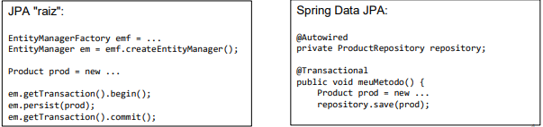

O JPA, além disso, gerencia as entidades atribuindo estados a ela. Ou seja, ela tem um ciclo de vida.

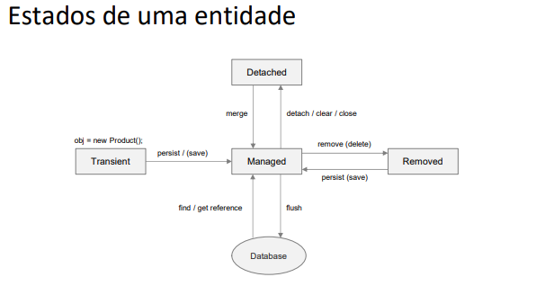


## Salvando entidade associada para um - PT 1, 2 e 3

Quando uma entidade está associada a outra e essa outra, é somente uma. Exemplo:

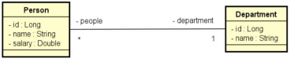

Como salvar uma pessoa associada a um departamento?

[Repositório para fazer o exercício](https://github.com/devsuperior/aula-salvar-para-um)

Temos duas formas de fazer isso: com objeto aninhado, ou seja, passando um nome, salário e um objeto de department 
com seu id, ou passando somente o id do department. Faremos das duas formas!

### 1. Objeto Aninhado

Requisição Post

```json 
POST http://localhost:8080/people
{
  "name": "Nova Pessoa",
  "salary": 8000.0,
  "department": {
  "id": 1
  }
}
```

### O primeiro passo é criar um DTO para recebermos os dados e instanciar um objeto Java.

Esse DTO criado, precisa ter os dados da pessoa + o seu departamento, exatamente igual na imagem acima.

**Como não podemos dentro de um DTO usar uma entidade**. Precisaremos também criar um DepartmentDTO.

<hr>

### O segundo passo é criar um service para realizar a operação

Criaremos o Service juntamente com o método Insert recebendo o DTO criado.

Importar o repository.

Criaremos uma entity Person vazia.

Copiaremos os dados do DTO para a nossa entidade Person.

Para colocar o ID do department dentro da Entity, precisa instanciar um departament para puxar os dados do dto.

Por fim, precisamos converter de Entity para DTO.

Para isso é só nos DTOS, criar um construtor apto a receber um Person. Já no DepartmentDto, ele precisa de um construtor
para receber um Department. (Qualquer coisa ver o video na pt2).

Salva e dá o return.
<hr>

### O terceiro passo é criar um controller

Injetaremos o service e colocaremos na classe o método insert, passando os parâmetros juntamente com a lógica correta.

A lógica é a de sempre... ResponseEntity + URI. (Qualquer coisa ver o video na pt2).

<hr>

### Teste no Postman

Aqui é só dar o Post no HTTP da imagem acima, juntamente com os pârametros JSON. Ao dar send, deve funcionar.


<hr>

### 2. Passando somente o id do department

Requisição Post

```json
POST http://localhost:8080/people
{
  "name": "Nova Pessoa",
  "salary": 8000.0,
  "departmentId": 1
}
```

### O primeiro passo é criar o DTO contendo exatamente a estrutura acima (name, salary e departmentID).

Diferente do exemplo acima, essa classe tera um atributo "Long departmentId".

Para pegar o id do department: o construtor de conversão de entidade para DTO, usaremos entity (parametro), para acessar
o departamento e pegar seu id. (Qualquer coisa, video pt3)
<hr>

### O segundo passo é no service já criado, criar um novo método de insert

Mas dessa vez, o retorno será PersonDTO e não PersonDepartmentDTO.

O raciocínio de lógica é o mesmo. 
<hr>

### O terceiro passo é no Controller criar um novo método de insert também

Fazer as alterações no método.

<hr>

### Teste no Postman

Só dar o HTTP com os dados da imagem acima e esperar a inserção.

## Salvando entidades associadas para muitos

Quando uma entidade é ManyToMany.

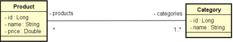

[Repositório para fazer o exercício](https://github.com/devsuperior/aula-salvar-para-muitos)

Requisição Post:

```json
POST http://localhost:8080/products
        
{
    "name": "Produto novo",
    "price": 1000.0,
    "categories": [
      {
        "id": 2
      },
      {
        "id": 3
      }
    ]
}
```

A intenção é inserir um novo produto, que terá uma lista de categorias aninhada.

### Primeiro Passo 

Criar os DTOS, tanto de Category quanto de Product, com os seus atributos.

Lembrar também, de criar os construtores para versão a conversão dos datos (de entity para DTO). Qualquer coisa, ver
a aula "**salvando entidades associadas para muitos**".

A única coisa diferente é: No ProductDTO para converter de entidade para DTO, na parte da lista de categorias, 
precisamos fazer um for dentro do construtor para inserir direitinho.

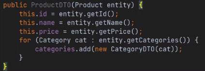
<hr>

### Segundo passo

Criar um controller e fazer a lógica de sempre.
<hr>

### Terceiro passo

Criar um service e fazer a lógica de sempre. 
A diferença é que para inserir a lista de categorias, precisa fazer um for. Qualquer coisa, ver a aula "**salvando 
entidades associadas para muitos**".
<hr>

### Postman

Só fazer um post com a requisição lá de cima e inserir.

## Evitando degradação de performance (Lentidão JPA)

Nós podemos melhorar o desempenho da JPA usando ela de forma apropriada.

Como evitar a lentidão da JPA? Com carregamento lazy, tratativas e transactional. 

Grande vilão da JPA: indas e vindas desnecessárias ao banco de dados.

Uma causa comum: entidades associadas lazy carregando sob demanda.

[Projeto exemplo](https://github.com/devsuperior/aula-lazy)

[Collection do Postman](https://www.postman.com/collections/d5efb333d1d308d52b7c)

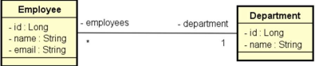

## Carregando EAGER e LAZY

Temos um carregando padrão para entidades que estão associadas.

ToOne - **EAGER**: Um carregamento apressado. Se carregarmos uma entidade e ela tiver outra entidade associada (para um),
essa outra entidade virá junto, na mesma hora.

ToMany - **LAZY**: Um carregamento mais preguiçoso/tardio. Se carregarmos uma entidade e tiver outras associadas (para
muitos), essas outras não serão carregadas.

## Analisando o carregamento lazy dos funcionários

Em virtude do comoportamento lazy (carregar de forma tardia) os objetos, devemos citar o seguinte: enquanto a sessão
JPA estiver ATIVA, o acesso a um objeto associado pode provocar uma nova consulta ao banco.

Ou seja, se buscarmos um departamento pelo ID, ele não irá trazer os funcionários. Mas se a sessão tiver ativa e dermos
um ".getEmployes" nesse departamento a gente pode disparar uma nova consulta ao banco de dados.

Exemplo:

Postman 

Pegando o department pelo Id 1 e depois, pegando os funcionários desse departamento.


Console

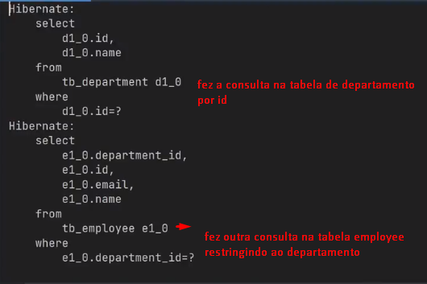


## Alterando o atributo fetch dos relacionamentos

E se quiséssemos trocar o comportamento acima e fazer somente uma consulta?

Existem 3 formas:

1. Atributo fetch no relacionamento da entidade (não recomendado);
2. Cláusula JOIN FETCH;
3. Consulta customizada (ideal).

O item 1 não é recomendado, pois você muda o comportamento padrão daquele relacionamento. Então se fizermos essa 
alteração, ela passa a ser o padrão da aplicação.

Em resumo, ocorreria: sempre que buscássemos o departamento, viria também os funcionários.

### Eager

Na classe Department

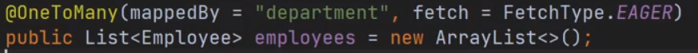

Assim, ao buscar um departamento específico ele sempre fará o left join com a tabela employee.

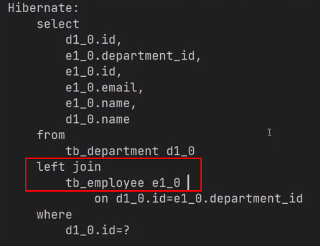

<hr>

### Lazy

Se buscássemos um funcionário por seu ID, chamando os dados minimos, dessa forma:


Ele retornaria o que desejamos:

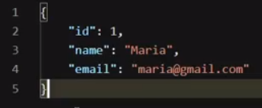

Mas no console, se observarmos, ele também consultará o departamento, pois como padrão estará EAGER.

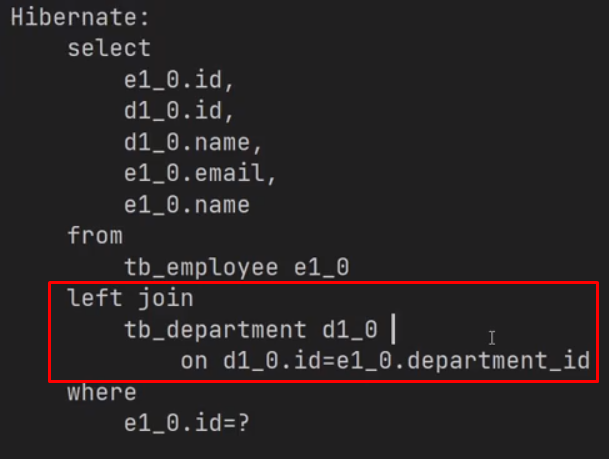

Podemos fazer a troca do atributo para Lazy. LEMBRANDO: ESTA FORMA NÃO É O IDEAL.

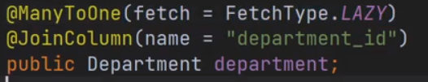

Agora, a consulta será somente da tabela de funcionários:


Abaixo, faremos da forma correta! Veja 👇

## Otimizando consultas com cláusula JOIN FETCH

❗Importante dizer, essa cláusula não funciona para busca paginadas do Spring.

Na classe de EmployeeRepository, criaremos um método com uma consulta personalizada

Exemplo:

```java
public interface EmployeeRepository extends JpaRepository<Employee, Long> {
    @Query("SELECT obj FROM Employee obj")
    List<Employee> findEmployeesWithDepartments();
}
```

Importante ressaltar, essa consulta na query não é SQL e sim JPQL, uma linguagem de consulta da JPA. A semântica muda,
**precisamos dar um "apelido" pro objeto que vamos buscar. Como colocamos acima: "obj".** E no final, **não precisa
colocar o nome da tabela e sim da classe, conforme colocamos: Employee.**

❗Importante

A JPA mantém um "cache" das entidades gerenciadas na mesma sessão JPA.

Ou seja, se você trouxer essas entidades para a memória, A JPA não volta ao banco se você precisar novamente delas
(desde que seja a mesma seção JPA).

Com o código daquele jeito acima, ele buscaria alguns departamentos até achar o correto.

Para que isso não aconteça, utilizamos o **JOIN FETCH**, veja:

```java
public interface EmployeeRepository extends JpaRepository<Employee, Long> {
    @Query("SELECT obj FROM Employee obj JOIN FETCH obj.department")
    List<Employee> findEmployeesWithDepartments();
}
```

Consulta otimizada no console, buscando por funcionários já fazendo o Join no department:

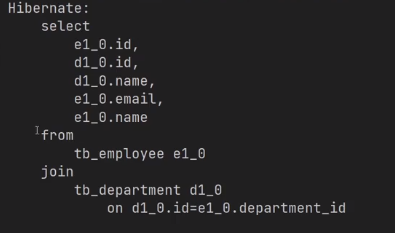

## Entendendo Transactional

A annotation @Transactional assegura:

1. resolução da transação com o banco de dados;
2. resolução de todas as pendências "lazy" com o banco de dados.


## open-in-view

A propriedade spring.jpa.open-in-view=false faz com que a sessão JPA seja encerrada antes de voltar para a camada 
controller (camada web).

**A ideia é que assim que o controlador receba a requisição, a JPA não esteja mais aberta. Tudo será feito na camada de
serviço (pendências lazy, transações...).**

## Consultas Customizadas

Consultas personalizadas, com filtros e critérios específicos.

## Query Methods

No JpaRepository do Spring Data JPA, é possivel fazer uma consulta customizadas apenas pelo nome do método.

Exemplo:

```java
public interface UserRepository extends Repository<User, Long> {
    //escrevendo somente isso com os parâmetros, ele vai funcionar
  List<User> findByEmailAddressAndLastname(String emailAddress, String lastname);
}
```

[Veja mais](https://docs.spring.io/spring-data/jpa/reference/jpa/query-methods.html)

^ Embaixo nesse link tem uma tabela com "keywords" suportadas pela JPA para realizar os métodos.

[Veja aqui as keywords](https://docs.spring.io/spring-data/jpa/reference/repositories/query-keywords-reference.html)

**Vale a pena utilizar?**

Para consultas muito simples, sim.

Mais complexas? Melhor escrever a consulta, pois já dominamos a consulta SQL.

### Buscando Employee por name


No Spring, criaremos um método para essa consulta, veja:

No Controller:
```java
@GetMapping
public ResponseEntity<List><EmployeeMinDTO>> findByName(
        //default value é: se o nome não for informado, por padrão será
        //uma string vazia
        @RequestParam(name= "name", defaultValue = "") String name) {
        
    List<EmployeeMinDTO> result = service.findByName(name);
    return ResponseEntity.ok(result);
}
```
<hr>

No Service:
```java
@Transactional(readOnly = true)
public List<EmployeeMinDTO> findByName(String name) {
    
    //criaremos esse método abaixo no repository
    List<Employee> result = repository.findByName(name);
    
    //convertendo o result acima para um tipo DTO
    return result.stream().map(x -> new EmployeeMinDTO(x)).toList();
}
```
<hr>

No Repository:
```java
public interface EmployeeRepository extends JpaRepository<Employee, Long> {
    
    //caso quiséssemos procurar por "maria" ou "Maria", colocar
    // "IgnoreCase" no final dos métodos (aqui e no service também).
    List<Employee> findByName(String name);
}
```

## Introdução sobre JPQL

É uma linguagem de consulta específica da JPA.

Toda ferramente ORM geralmente possui uma linguagem ou ferramentas próprias para realização de consulta a banco de dado.

A JPQL é parecida com a SQL, porém é adaptado para modelo de acesso a dados JPA.

### Exemplo 1

SQL:
```sql
SELECT *
FROM tb_employee
WHERE UPPER(name) LIKE 'MARIA%'
```

JPQL
```sql
SELECT obj

//não escrevemos a tabela e sim Entidade + obj
FROM Employee obj
//obj.name pois estamos acessando o atributo
WHERE UPPER(obj.name) LIKE 'MARIA%'
```
<hr>

### Exemplo 2

SQL:
```sql
SELECT tb_employee.*
FROM tb_employee
INNER JOIN tb_department ON tb_department.id = tb_employee.department_idWHERE tb_department.name = 'Financeiro'
````

JPQL:
```sql
SELECT obj
           
//não escrevemos a tabela e sim Entidade + obj
FROM Employee obj

//obj.department (para acessar dep dentro de employee) + .name para acessar o nome de department
WHERE obj.department.name = 'Financeiro'
```

## Polêmica: vale a pena se especializar em JPQL?

**Vantagens**:

1. Algumas consultas podem ficar mais simples;
2. Usufrui melhor do Spring Data JPA (paginação, JpaRepository);
3. Os objetos resultantes são entidades gerenciadas pela JPA.
   4. Se precisarmos dar uma ".get" será automaticamente feita a consulta auxiliar.

**Desvantagens**:

1. Consultas complexas podem ficar difíceis de escrever e validar (mais fácil escrever e testar a consulta SQL)
diretamente na ferramenta de banco de dados;
2. Não tem união (JPA 2.x);
3. Curva de apredizada para uma tecnologia específica.

Em suma, se for consulta simples usa **JPQL**. Se for mais específica e complexa, **SQL**.
<hr>

## Estudos de Caso

Todos os estudos de caso você pode encontrar nesse [repositório](https://github.com/zenonxd/bdsconsultas-main)

Nesse repositório, terá como fazer as projeções de dados + utilizando DTO.

Cada estudo tem a sua explicação e diferenças de código SQL e JPQL.

## DSCommerce consulta de produtos por nome

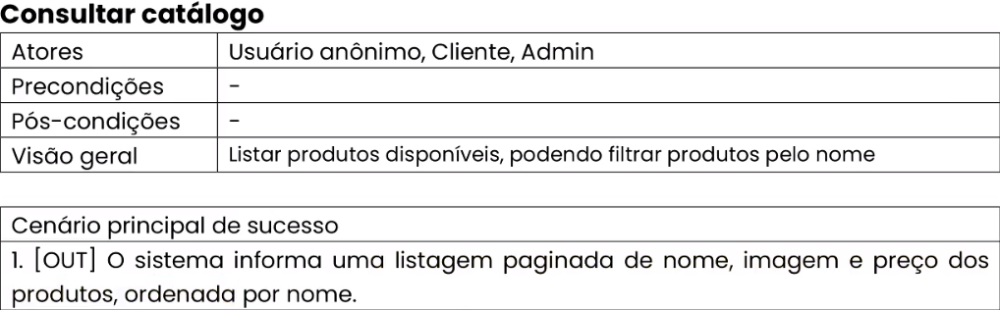

Para fazermos uma busca customizada, no ProductRepository, criaremos um método para isso, veja:

```java
@Repository
public interface ProductRepository extends JpaRepository<Product, Long> {

    @Query("SELECT obj FROM Product obj " +
            "WHERE upper(obj.name) LIKE upper(concat('%', :name, '%'))")
    Page<Product> searchByName(String name, Pageable pageable);
}
```

Mesma coisa dos casos de uso acima. 

1. Criaremos a query JPQL 
2. Damos o nome de obj para o Product
3. Usamos upper() para não importar maiscula/minuscula
4. Concat, pois o LIKE espera um '%'.

No service, faremos a alteração:
-

Antes:
```java
    @Transactional(readOnly = true)
    public Page<ProductDto> findAll(Pageable pageable) {
        Page<Product> products = productRepository.findAll(pageable);

        //pode fazer .map direto pois Page já é uma stream
        return products.map(x -> new ProductDto(x));
    }
```

Depois:
```java
    @Transactional(readOnly = true)
    public Page<ProductDto> findAll(String name, Pageable pageable) {
        Page<Product> products = productRepository.searchByName(name, pageable);

        //pode fazer .map direto pois Page já é uma stream
        return products.map(x -> new ProductDto(x));
    }
```

Controller:
-

O Controller precisa receber um parâmetro de consulta. Parâmetro de consulta é, por exemplo, aqueles que
passamos na busca paginada no Postman, veja:


?size=12&page... Isso seria os parâmetros de consulta.


Antes:
```java
    @GetMapping
    public ResponseEntity<Page<ProductDto>> findAll(Pageable pageable) {
        Page<ProductDto> dto = productService.findAll(pageable);

        return ResponseEntity.status(HttpStatus.OK).body(dto);
    }
```

Depois:
```java
    @GetMapping
    public ResponseEntity<Page<ProductDto>> findAll(
            @RequestParam(name = "name", defaultValue = "") String name,
            Pageable pageable) {
        Page<ProductDto> dto = productService.findAll(name, pageable);

        return ResponseEntity.status(HttpStatus.OK).body(dto);
    }
```

Usamos o @RequestParam para extrair os parâmetros de consulta :)


## Evitando consultas lentas muitos-para-muitos

[Repositório](https://github.com/devsuperior/aulao_nmais1)

Problema N + 1

Basicamente, um sistema de produtos e categorias e entre eles terá uma relação many to many. Ou seja: um produto pode
ter muitas categorias e uma categoria pode ter muitos produtos.

E daí queremos fazer uma busca paginada, buscando os produtos já com as suas categorias.

Para evitar que ao realizarmos essa consulta, o hibernate faça diversas consultas para buscar os objetos que estão
relacionados, faremos o seguinte:

**No repository**, faremos uma consulta customizada com JPQL. 

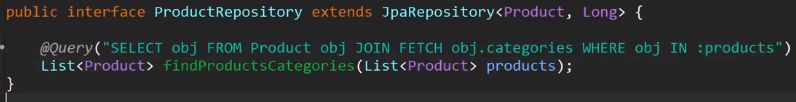

❗Caso queira fazer uma busca paginada com Join Fetch, veja o [tópico abaixo](#para-fazer-uma-consulta-paginada-no-repository)

Essa query, fará exatamente o papel dessa query SQL:

```sql
SELECT * FROM tb_product 
	INNER JOIN tb_product_category ON tb_product.id = tb_product_category.product_id
	INNER JOIN tb_category ON tb_category.id = tb_product_category.category_id
	WHERE tb_product.id IN (1,2,3,4,5)
```
<hr>


**No service**, utilizaremos este método:

A gente mantém o ".findAll" padrão do repository que retornará um Pageable, e transformaremos isso numa lista.

Depois, transformaremos essa lista em um DTO.

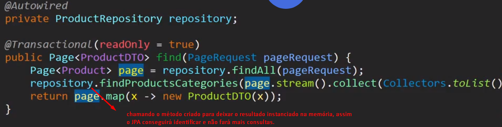
<hr>

**No controller**:

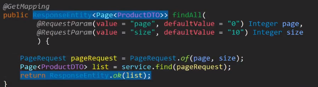

## Evitando consultas lentas muitos-para-um com countQuery

[Repositório](https://github.com/devsuperior/jpa-queries1)

Sabemos que para realizar a consulta no banco de dados, podemos utilizar o SQL ou JPQL.

Entretanto, essas consultas podem se tornar ineficientes por fazerem diversas indas e vindas no banco de dados.

### Para fazer uma consulta Paginada no Repository

Usaremos dentro da query um countQuery, veja:

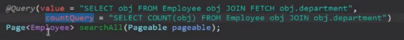